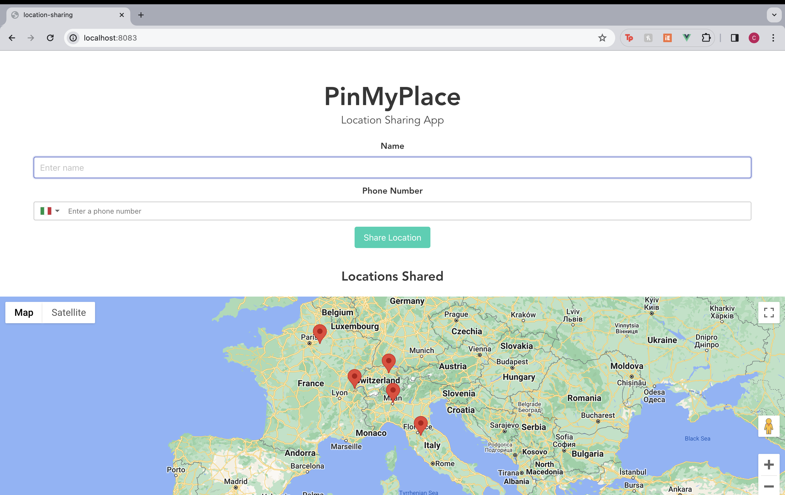

# location-sharing

[](https://youtu.be/EidskSYNn6M)


## Project setup
```
npm install
```

### Compiles and hot-reloads for development
```
npm run serve
```

### Compiles and minifies for production
```
npm run build
```

### Run Server
```
node server.js
```

### Customize configuration
See [Configuration Reference](https://cli.vuejs.org/config/).
# location-sharing
